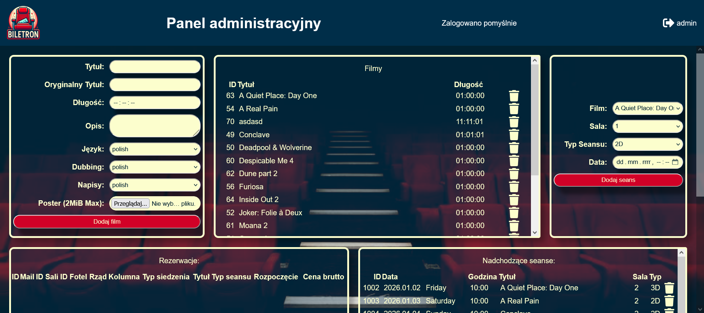

# wdpai

To set up the project do the following steps:

1. Clone the repository with `git clone https://github.com/Pawloland/wdpai.git`
2. Copy `.env.example` to `.env` and change the default values to your own secrets
3. Change `INSERT INTO "User"` entries in `db_init_plus_example_data.sql` to change default passwords, that are bcrypt hashed nick columns by default
   (I generated them from php by calling `password_hash('admin', PASSWORD_BCRYPT);` where admin is a password string that will be hashed)
4. Build containers with `docker compose build`
5. Run containers with `docker compose up`
6. Default website address is <a href="http://localhost:8080">http://localhost:8080</a>
7. Default pgadmin address is <a href="http://localhost:5050">http://localhost:5050</a>

Main endpoints accessible from the website:

For client:

- <a href="http://localhost:8080/">http://localhost:8080/</a> - Home page
- `http://localhost:8080/select_place?ID_Movie=x` - Reservation page for movie with ID x
- <a href="http://localhost:8080/login">http://localhost:8080/login</a> - Login page
- <a href="http://localhost:8080/register">http://localhost:8080/register</a> - Register page
- <a href="http://localhost:8080/logout">http://localhost:8080/logout</a> - Logout page

For administration:

- <a href="http://localhost:8080/admin_panel">http://localhost:8080/admin_panel</a> - Admin panel page
- <a href="http://localhost:8080/adminLogout">http://localhost:8080/adminLogout</a> - Admin logout page

## Screenshots

| Page Name       | Desktop Screenshot                                                                                      | Mobile Screenshot                                                                                                         |
|-----------------|---------------------------------------------------------------------------------------------------------|---------------------------------------------------------------------------------------------------------------------------|
| Select movie    |                                                |   |
| Register        |                                                        |                                                                        |
| Login           |                                                              |                                                                              |
| Select place    |                                                |                                                                |
| Admin Panel     |   |                                                                        |